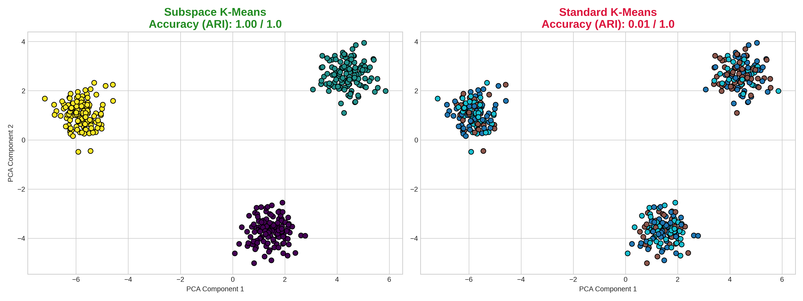
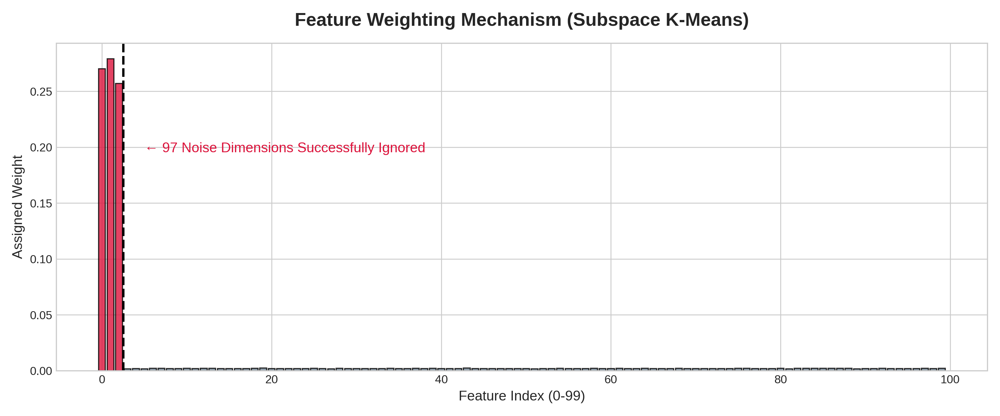
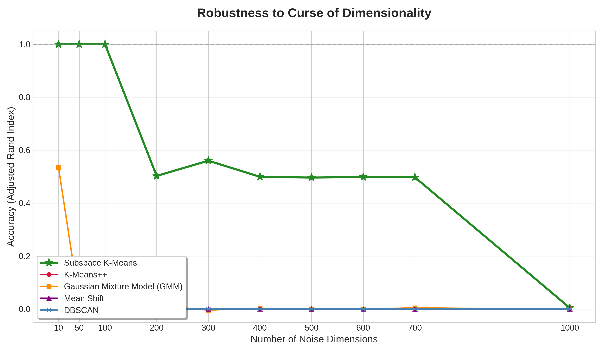

# High-Dimensional Subspace Clustering

Оптимизированная реализация алгоритма Subspace Clustering K-Means. Проект направлен на решение фундаментальной проблемы машинного обучения — **Curse of Dimensionality** (проклятия размерности) при анализе многомерных данных.

Классические алгоритмы кластеризации (K-Means, DBSCAN, GMM, Mean Shift) теряют свою эффективность в многомерных пространствах. Дистанционные метрики искажаются из-за подавляющего количества нерелевантных (шумовых) признаков, в которых тонет полезный сигнал. Данный проект решает эту проблему, используя **Expectation-Maximization (EM)** алгоритм с множителями Лагранжа для динамического вычисления весов каждого признака в процессе кластеризации.

## Описание алгоритмов

### Алгоритмы кластеризации для многомерных данных
**1. Subspace K-means**
* Этот алгоритм напрямую расширяет классический K-means для задачи кластеризации в подпространствах (Subspace Clustering) путем умножения каждого измерения $d_j$ на весовой коэффициент $m_j$ (при условии, что $\sum m_j = 1, j=1,2,...,p$).
* Задача эффективно решается с помощью концепции EM-алгоритма (Expectation-Maximization). На каждом шаге происходит обновление весов и центроидов с использованием множителей Лагранжа.
* В своем базовом виде этот алгоритм имеет недостаток: при кластеризации разреженных данных он склонен чрезмерно завышать веса лишь для нескольких измерений, игнорируя остальные.

**2. Entropy-Weighting Subspace K-means**
* В общих чертах логика работы аналогична базовому Subspace K-means.
* Однако, для устранения вышеописанной проблемы, в целевую функцию алгоритма вводится дополнительный элемент регуляризации, основанный на энтропии весов (weight entropy). Это заставляет алгоритм распределять веса более справедливо.
* Благодаря своей лаконичности и вычислительной эффективности, данный метод демонстрирует отличные результаты на широком спектре реальных наборов данных.


### Стандартные алгоритмы кластеризации
В рамках исследования алгоритм Subspace сравнивается со следующими классическими подходами:
* **K-means:** Классический алгоритм разбиения на основе евклидова расстояния до центроидов.
* **K-means++:** Модификация K-means с улучшенной инициализацией (методом рулетки / Fitness Proportionate Selection). Вероятность стать новым центроидом выше у точек, максимально удаленных от уже существующих, что снижает риск попадания в локальные минимумы.
* **Mean Shift:** Непараметрическая модель, сдвигающая точки к локальным максимумам плотности (среднему вектору соседей). Не требует заранее заданного числа кластеров.
* **DBSCAN:** Пространственная кластеризация на основе плотности. Расширяет кластеры на основе связности, устойчива к выбросам (шуму), но крайне уязвима к многомерным пространствам из-за общего падения плотности.
* **Gaussian Mixture Model (GMM):** Вероятностная модель, описывающая данные как смесь нескольких гауссовских распределений.


## Особенности реализации
* **Core C++:** Вся математика написана на чистом C++ (STL) без использования внешних зависимостей.
* **Feature Weighting:** Алгоритм выявляет информативные измерения, а веса шумовых данных принудительно обнуляются (создание разреженности).
* **Experiments Python:** Автоматизированные скрипты для генерации синтетических данных, проведения бенчмарков и визуализации.

## Результаты работы (Бенчмарки)

### 1. Визуальное сравнение алгоритмов
На наборе данных из 100 измерений (где 97 измерений — случайный шум) классический K-Means полностью теряет структуру данных. Наша реализация Subspace Clustering успешно игнорирует шум и восстанавливает исходные кластеры со 100% точностью (ARI = 1.0).

<p align="center">
  
</p>

### 2. Механизм динамического взвешивания
В процессе EM-шагов алгоритм анализирует дисперсию по каждой оси. На графике ниже продемонстрировано, как алгоритм присвоил высокие веса первым трем (информативным) признакам, а веса остальных 97 шумовых признаков были сведены к нулю.

<p align="center">
  
</p>

### 3. Устойчивость к росту размерности
Сравнительный анализ устойчивости алгоритмов при последовательном добавлении **до 1000 шумовых измерений**. 
* Стандартные подходы (GMM, K-Means++, Mean Shift, DBSCAN) стремительно деградируют до ARI около 0.0 уже при 10–50 шумовых признаках. 
* **Subspace K-Means** сохраняет идеальную точность (ARI = 1.0) вплоть до 100 шумовых измерений, превосходя классические алгоритмы в десятки раз, прежде чем окончательно уступить экстремальному давлению размерности.

<p align="center">
  
</p>

## Установка и запуск

**Шаг 1. Установка зависимостей.**
Клонируйте репозиторий и установите необходимые Python-библиотеки:
```bash
git clone https://github.com/antonbezzaborov/SubspaceClustering.git
cd SubspaceClustering
pip install -r requirements.txt
```
**Шаг 2.  Компиляция C++ ядра.**
Скомпилируйте исполняемый файл из исходников. Находясь в корневой директории проекта, выполните:
```bash
g++ -O3 src/main.cpp src/SubspaceKMeans.cpp -o subspace_kmeans
```

**Шаг 3. Запуск экспериментов.**
Запустите Python-скрипт, который автоматически сгенерирует данные, выполнит кластеризацию и сохранит графики:
```bash
python run_experiments.py
```


